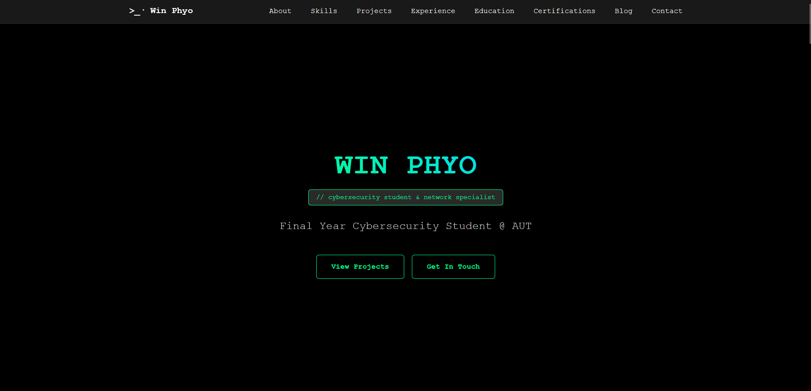

# 🕶️ Win Phyo | Cybersecurity Portfolio

<i>Personal portfolio site of Win Phyo. 
Showcasing my journey, skills, and projects in cybersecurity. 
Not intended for public use or deployment by others.</i>

---

- **Hero** - Introduction with social links
- **About** - Personal background and stats
- **Skills** - Technical competencies
- **Experience** - Work history
- **Education** - Academic background
- **Certifications** - Professional credentials
- **Projects** - Featured work
- **Blog** - Latest posts
- **Contact** - Get in touch
---

## 🙏 Credits

**Template Base:** This portfolio is based on the [Cyber Portfolio Template](https://github.com/serozr/cyber-portfolio) by [serozr](https://github.com/serozr). 

---

## 👨‍💻 Author

**Win Phyo** - Cybersecurity Student @ AUT  
- LinkedIn: [winphyo-it](https://linkedin.com/in/winphyo-it)
- GitHub: [cyber-wpmm](https://github.com/cyber-wpmm)
- Email: winphyo.wpmm@gmail.com

---

**Built with ❤️ by Win Phyo**

